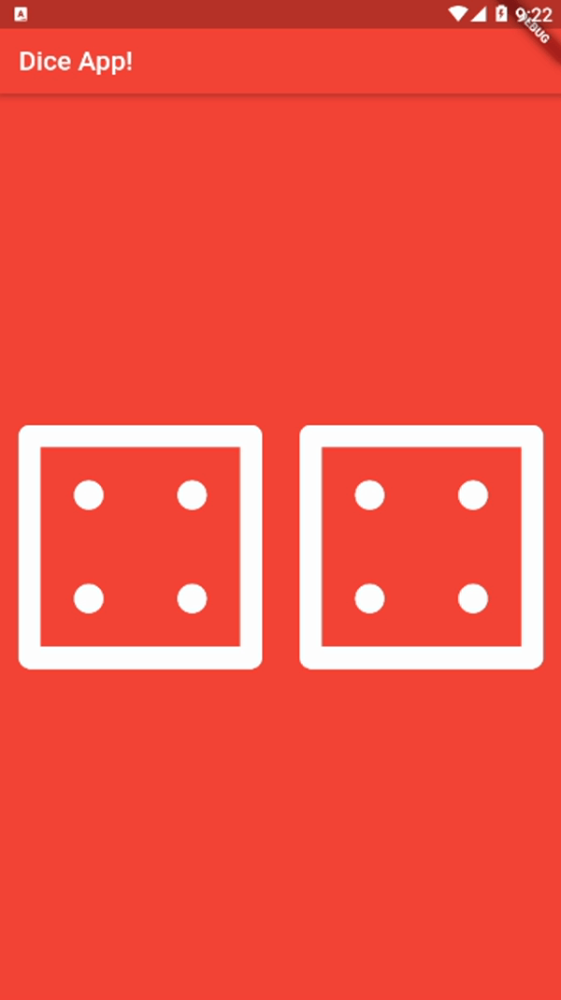

# ~ Flutter Project #3 - Dice App 🎲

### ~ Project Preview 🖼️ 



### ~ Project Purposes ℹ️ 

```sh
In this third module, we had several objectives to reach:
```

* Learn the difference between `StatelessWidget` & `StatefulWidget`, when to use each of them and how to update the state of a variable using `setState()`.

* How to avoid having to repeat the code to update the state of the application by extracting it to a unique method, later implemented on the `onPressed` (@required) property of a button.

* Usage of Dart's librarires such as `dart:math` to randomize the display of the dice images by implementing the nextInt() built-in method.

```sh
Also we have used several new widgets to create this application:
```

  - Expanded()
  - FlatButton()
  - Image.asset()